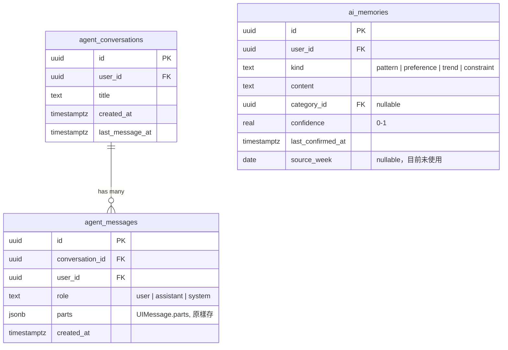
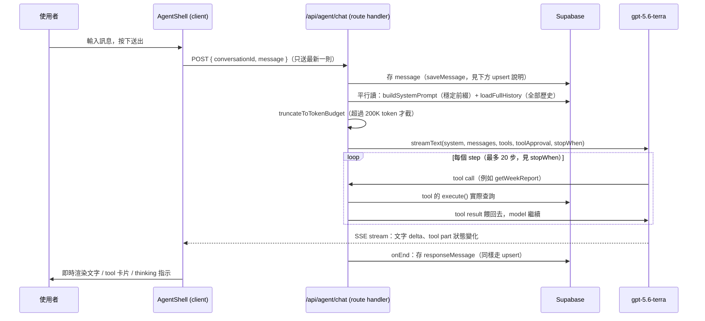

# AI Agent 架構文件

這份文件描述 Chronica AI Agent（`/agent` 頁面，含 Chat、Memory、`/retro`、`/plan`）目前的技術設計。它是**活文件**：這個子系統之後有任何架構層級的改動（換 model、換資料表、換 tool 集合、換前端狀態管理方式），**改程式的同一個 PR 裡就要同步更新這份文件**，不要留給下一次才補。

閱讀順序：先看〈總覽〉抓住整體形狀，再依你要改的部分跳到對應章節。每章開頭都盡量附「哪些檔案在管這件事」，方便直接對照原始碼。

## 目錄

1. [總覽與關鍵決策](#總覽與關鍵決策)
2. [資料庫 Schema](#資料庫-schema)
3. [請求生命週期](#請求生命週期)
4. [核心模組導覽](#核心模組導覽)
5. [Tool 清單](#tool-清單)
6. [Memory 系統](#memory-系統)
7. [`/retro` 與 `/plan` Playbook](#retro-與-plan-playbook)
8. [前端：Agent 頁面](#前端agent-頁面)
9. [已知限制與踩過的坑](#已知限制與踩過的坑)
10. [維護這份文件](#維護這份文件)

---

## 總覽與關鍵決策

Agent 取代了原本 Planning 頁面上「一次性 AI Retro 按鈕」（Mastra Agent、`retros` 資料表，已在移除）。現在是一個完整的 Chat 介面：使用者可以自由提問、跑 `/retro`（回顧過去某週）、跑 `/plan`（規劃下一週並直接寫入 Planning 板），Agent 同時維護一份跨對話的長期記憶（Memory）。

實作前經過一輪完整的需求訪談，幾個**刻意**的技術選擇、以及為什麼：

| 決策                                                       | 選了什麼                                                                                                                                                  | 為什麼                                                                                                                                                                                                                                    |
| ---------------------------------------------------------- | --------------------------------------------------------------------------------------------------------------------------------------------------------- | ----------------------------------------------------------------------------------------------------------------------------------------------------------------------------------------------------------------------------------------- |
| Agent framework                                            | 不用 Mastra、不用 AG-UI，純 [Vercel AI SDK](https://ai-sdk.dev)（`ai` + `@ai-sdk/react` + `@ai-sdk/openai`）                                              | AG-UI 的官方 Vercel AI SDK adapter 當時未發布到 npm、停在 AI SDK v4（現行 v7），且被回報 spec 不完整；而 AI SDK 原生的 `useChat` + tool-approval 機制已經覆蓋這個 app 需要的所有能力（streaming、tool calling、human-in-the-loop 核准）。 |
| Agent 迴圈跑在哪                                           | In-process，在 Next.js route handler 裡（`src/app/api/agent/chat/route.ts`）                                                                              | 不需要額外部署一個 agent server；tools 直接拿 request-scoped Supabase client，RLS 負責使用者隔離，不用自己重造一層權限檢查。                                                                                                              |
| Model                                                      | `gpt-5.6-terra`，直連 OpenAI Responses API                                                                                                                | 明確 pin 住（`gpt-5.6` 這個 alias 會指向 Sol，不是 Terra，是個陷阱）。Reasoning effort 固定 `medium`。                                                                                                                                    |
| Context 策略                                               | System prompt 分兩層：**穩定前綴**（categories、principles、memories、時區、今天日期）直接塞進 system prompt；**會隨日期變動的資料**一律透過 tool call 拿 | 穩定前綴每輪內容不變，能命中 provider 的 prompt cache；tool call 則保證資料一定是即時的，不會因為塞進 system prompt 而過期。                                                                                                              |
| 對話歷史怎麼送給 model                                     | Client 每次只送**最新一則訊息**；server 從資料庫重建完整歷史，套一個 token 上限（`DEFAULT_HISTORY_TOKEN_BUDGET = 200_000`）後才丟給 model                 | Client 本身有 lazy loading（見〈前端〉），不會拿著完整訊息陣列；server 才是真相來源。Terra 的 1.05M context window 讓 200K 這個安全上限幾乎不會被日常對話碰到。                                                                           |
| Memory 形狀                                                | 結構化列（`kind` / `confidence` / `category_id` / `last_confirmed_at`），confidence 隨時間 decay                                                          | 需要區分「習慣模式」跟「一次性偏好」，也需要讓過時的觀察自然淡出，而不是無限累積、永遠影響未來的 prompt。                                                                                                                                 |
| Memory 寫入是否要人工核准                                  | 不用——自動寫入，但 UI 即時顯示成卡片、Memory 抽屜可隨時編輯/刪除                                                                                          | 若每條記憶都要核准，`/retro` 一次要按 5-8 次核准鍵，體驗會差到沒人想用這個功能。事後可審視/修正已經足夠。                                                                                                                                 |
| `writeWeekPlan`（唯一會寫入 Planning 板的 tool）是否要核准 | **要**——用 AI SDK 原生 `toolApproval`                                                                                                                     | 這是唯一真的會改變使用者資料的 tool，且是不可逆的（新增到 Planning 板）。其他 tool 都是唯讀或寫在低風險的 Memory 上。                                                                                                                     |

---

## 資料庫 Schema

對應 migration：`supabase/migrations/20260822020000_agent_schema.sql`（新表）、`20260822030000_agent_messages_bump_on_update.sql`（trigger 修正，見下方「為什麼要 upsert」）、`20260822010000_drop_retros.sql`（移除舊的 `retros` 表）。



重點：

- **`agent_messages.parts` 存的是 AI SDK `UIMessage.parts` 陣列本身**（text part、tool-call part、tool-result part、approval part 全部原樣存），不是存渲染後的字串。這樣重新打開一段對話時，tool 卡片、approval 狀態都能完整重繪，而不是退化成一段純文字。
- 兩張表都有 owner-only RLS（`(select auth.uid()) = user_id`），跟 repo 其他表一致。
- `agent_conversations.last_message_at` 由 trigger `bump_agent_conversation_last_message()` 維護，**同時掛在 `after insert` 和 `after update`**——這是修過的一個坑，見〈已知限制與踩過的坑〉。
- `ai_memories` 是既有表擴充（原本只有 `content`），新增 `kind`／`category_id`／`confidence`／`last_confirmed_at`／`source_week`。`source_week` 欄位存在但目前程式沒有寫入它，是留給未來想標註「這條記憶是哪週 retro 產生的」時用。

---

## 請求生命週期



幾個容易誤解、值得特別說明的地方：

**Client 永遠只送一則訊息。** `prepareSendMessagesRequest`（`agent-shell.tsx`）把 `useChat` 內部管理的完整訊息陣列砍到只剩最後一則，連同 `conversationId` 一起送給 server。Server 端 `loadFullHistory()` 才是重建完整上下文的地方。這個設計是為了配合前端的 lazy loading——client 本來就不一定握有完整歷史。

**兩種「訊息」會打到同一支 route：一般使用者訊息，跟 tool-approval 的回覆。** `bodySchema` 的 `message.role` 接受 `"user"` 或 `"assistant"` 兩種：

- `role: "user"`：正常的使用者輸入。
- `role: "assistant"`：使用者核准／拒絕了 `writeWeekPlan` 之後，`useChat` 會把**同一個** assistant message id 重新送一次，只是這次它的 approval part 從 `approval-requested` 變成 `approval-responded`。Route handler 用 `isApprovalResponse` 判斷分支，但兩種情況最後都呼叫同一個 `saveMessage()`。

**為什麼 `saveMessage` 是 `upsert` 不是 `insert`。** 這是一個真的在 code review 抓到的 bug：approval 回覆重新送出的是「同一個 message id」，如果用 `insert`，第二次寫入會撞 primary key 衝突而報錯。而且 `onEnd` 存的 `responseMessage`，在「continuation」（model 恢復生成）的情況下，跟前面 approval 回覆存的**也是同一個 id**（AI SDK 把它視為延續，不是新訊息）。所以 `saveMessage()`（`src/server/agent/history.ts`）統一用 `upsert(..., { onConflict: "id" })`，並且 `bump_agent_conversation_last_message` trigger 也因此改成同時掛 `after insert or update`——否則 approval 那一輪的 `last_message_at` 不會更新，對話在列表裡的排序就會卡住不動。

**`stopWhen: stepCountIs(20)`。** `streamText` 預設 `stopWhen` 是 `stepCountIs(1)`——只跑一步。如果一步剛好是 tool call，迴圈會在 tool 執行完就停住，model 永遠沒機會讀 tool 結果、生成真正的回覆文字。這是上線後第一輪就撞到的 bug（`/retro` 呼叫完 `getWeekReport` 後整個沒下文），修法是把 `stopWhen` 拉高到 20 步，讓 Retro/Plan 這種需要串多個 tool call 再總結的流程走得完。

---

## 核心模組導覽

```
src/app/api/agent/chat/route.ts     — 整個 agent 迴圈的入口（見上方生命週期）
src/app/(app)/agent/
  page.tsx                          — Server Component，讀第一頁對話清單/訊息/memory，交給 AgentShell
  actions.ts                        — Server Actions：分頁查詢、刪除對話、memory CRUD

src/server/agent/
  model.ts                          — pin 住 gpt-5.6-terra、reasoning effort
  context.ts                        — system prompt：persona + /retro /plan playbook + 穩定前綴
  tools.ts                          — 唯讀 tools（getCategories, getEntries, getWeekReport, ...）
  memory-tools.ts                   — upsertMemory / deleteMemory
  plan-tools.ts                     — writeWeekPlan（唯一寫入 tool，approval-gated）
  history.ts                        — 建立對話、存訊息（upsert）、讀完整歷史、擁有權檢查
  conversations.ts                  — 分頁查詢（對話清單、單一對話的訊息）、刪除對話
  memories.ts                       — memory 的 CRUD + confidence decay + 超量剔除

src/lib/                            — 純函式，跟 Supabase/React 無關，全部有單元測試
  agent-report.ts                   — buildWeekReport：整合 settlement + 逐日 gap + 歷史準確度
  agent-messages.ts                 — UIMessage ↔ DB row 轉換、token 預算截斷
  agent-memory.ts                   — decayedConfidence、selectMemoriesToPrune

src/components/agent/
  agent-shell.tsx                   — 整個 Agent 頁的狀態機（useChat、對話/訊息分頁、slash command、UI）
  conversation-list.tsx             — 側欄／手機版對話清單，含 cursor 分頁與刪除
  message-parts.tsx                 — 渲染單則訊息的 parts：文字（markdown）、一般 tool 卡片、
                                       Memory 卡片、Plan 核准卡片，各自獨立的渲染邏輯
  markdown.tsx                      — react-markdown + remark-gfm，套用 dark theme 樣式
  memory-drawer.tsx                 — Memory 側邊抽屜：清單、inline 編輯、刪除

src/components/ui/page-container.tsx — 其他頁面用的置中+padding 容器；Agent 頁刻意不用它（見前端章節）
```

---

## Tool 清單

所有 tool 都用 AI SDK 的 `tool()` 定義，`inputSchema` 用 zod。每個 tool 拿到的都是同一個 `AgentToolContext = { supabase, userId, timeZone }`（`tools.ts` 定義），`supabase` 是這次 HTTP 請求的 request-scoped client（帶使用者的 session，RLS 自動生效）。

| Tool                | 檔案              | 讀/寫                   | 說明                                                                                                 |
| ------------------- | ----------------- | ----------------------- | ---------------------------------------------------------------------------------------------------- |
| `getCategories`     | `tools.ts`        | 讀                      | 所有類別（含封存、排除加總的）                                                                       |
| `getPrinciples`     | `tools.ts`        | 讀                      | 使用者的原則清單                                                                                     |
| `getEntries`        | `tools.ts`        | 讀                      | 指定日期區間的原始 time entries                                                                      |
| `getSummary`        | `tools.ts`        | 讀                      | 指定區間各類別加總時數——「上週 X 花了多少小時」這類問題的快速路徑                                    |
| `getPlannedItems`   | `tools.ts`        | 讀                      | 指定區間的 Planning 板項目，含 `gcalEventId`                                                         |
| `getWeekSettlement` | `tools.ts`        | 讀                      | 單週 planned vs actual                                                                               |
| `getAccuracy`       | `tools.ts`        | 讀                      | 歷史「實際/計畫」比例，看使用者是否習慣性高估或超支                                                  |
| `getDayGaps`        | `tools.ts`        | 讀                      | 單週逐日的「已記錄 vs 計畫」缺口，用來抓晚睡/長時間未記錄                                            |
| `getWeekReport`     | `tools.ts`        | 讀                      | **粗粒度**：一次回傳 settlement + dayGaps + accuracy，`/retro` 優先用這個，不要自己組 3 個 tool call |
| `upsertMemory`      | `memory-tools.ts` | 寫（低風險）            | 新增或（帶 `id`）重新確認一條記憶。不需要 approval                                                   |
| `deleteMemory`      | `memory-tools.ts` | 寫（低風險）            | 刪除一條記憶                                                                                         |
| `writeWeekPlan`     | `plan-tools.ts`   | **寫（需要 approval）** | 唯一會動 `planned_items` 的 tool，只會 insert，見下方細節                                            |

`writeWeekPlan` 的安全設計值得多寫幾句：

- Route handler 的 `streamText` 呼叫帶了 `toolApproval: { writeWeekPlan: "user-approval" }`——model 想呼叫這個 tool 時，AI SDK 會先把它渲染成 `approval-requested` 狀態送到前端，`execute()` 完全不會跑，直到使用者在 UI 按下核准。
- `execute()` 本身**只會 `insert`**，程式碼裡沒有任何 `update`/`delete` 路徑，所以就算 model 傳入奇怪的參數，也不可能改到或刪掉既有的 `planned_items` 列（不管是使用者手動排的，還是 `gcal_event_id` 非 null 的 Google Calendar 同步列）。
- 唯一的驗證是「每個項目的 `day` 必須落在目標週」（用已經有單元測試的 `weekDayKeysOf()` 檢查），落在週外就整批拒絕、回錯誤訊息給 model。
- Playbook（見下一章）要求 model 在呼叫這個 tool 之前，先呼叫 `getPlannedItems` 看目標週已經有什麼，讓使用者在核准前就知道會不會跟既有排程重疊——但這只是流程上的提醒，`writeWeekPlan` 本身不會因為偵測到既有項目就拒絕寫入。

---

## Memory 系統

檔案：`src/lib/agent-memory.ts`（純邏輯，單元測試在旁邊的 `.test.ts`）、`src/server/agent/memories.ts`（DB 操作）。

**Confidence decay。** `decayedConfidence(baseConfidence, lastConfirmedAt, now)`：每 60 天沒被重新確認，confidence 減半（`0.5 ** (days / 60)`），下限 0.05，不會歸零。這是**唯讀時計算**，不會改資料庫裡存的值——一條記憶如果被重新確認（`upsertMemory` 帶著它的 `id`），`last_confirmed_at` 會重置成現在，權重就恢復。System prompt 裡列出的 Long-term memory 一律用 decay 過的 `displayConfidence`，不是原始 `confidence`。

**超量剔除。** `MAX_MEMORIES = 40`。每次 `upsertMemory` 寫入後都會呼叫 `pruneMemories()`，撈出使用者全部記憶、按 decay 過的 confidence 排序，超過 40 條就刪掉信心最低的那些。這是「剔除舊 Memory」需求的實作位置。

**System prompt 何時該叫 `upsertMemory`。** 這個規則寫在 `context.ts` 的 Conduct 區塊，適用於**所有**對話類型（純問答、`/retro`、`/plan`、閒聊都算），不是只有 Retro 的總結步驟才做——這是上線後第二輪修過的 gap，一開始只在 `/retro` playbook 裡提到記憶維護，導致使用者在 `/plan` 過程講的原則性發言完全沒被記下來。現在的規則是：只要出現「習慣、原則、偏好、重複出現的模式」這種跨週還會成立的陳述，就立刻呼叫 `upsertMemory`，不用等到正式總結步驟。一次性狀態（「我今天很累」）不算。

**一個修過的真實 bug：不要盲信 model 傳的 `id`。** 曾經在 production 資料庫上實測到：model 在同一輪對話裡連續呼叫了三次 `upsertMemory`，理論上要建立三條不同的新記憶，但因為 `id` 欄位雖然標示為 optional，model 卻自己生了一個 placeholder UUID（`00000000-0000-0000-0000-000000000000`）填進去，導致三次呼叫全部 `upsert` 到同一列，只有最後一次的內容留下來，另外兩條資料永久遺失。修法在 `upsertMemory()`：**收到 `id` 時，先查一次這個 id 是否真的屬於這個使用者的既有記憶；查不到就當作沒帶 id，一律走新增**，不會盲目相信 model 傳來的任何字串當作 upsert target。這個教訓值得記住：任何工具函式，只要允許 model 傳入一個「用來指定要更新哪一列」的 id，都要在寫入前驗證那個 id 真的存在、真的屬於這個使用者，不能靠 `onConflict` 讓資料庫幫你當裁判。

**Memory 抽屜的資料是即時的，不是一次性快照。** 早期版本 `initialMemories` 只在頁面第一次載入時從 server fetch 一次，之後 Agent 在對話中新寫的記憶不會反映在抽屜裡，除非整頁重新整理。現在 `AgentShell` 在每一輪對話結束（`chat.status === "ready"`）後都會呼叫 `listMemoriesAction()` 重新拉取，`MemoryDrawer` 則在 render 期間（不是 `useEffect` 裡，理由見下方註解）比對 prop 是否變了、變了就同步進本地 state——用 render 期間調整而不是 `useEffect` + `setState`，是為了避開 React 的 `react-hooks/set-state-in-effect` lint 規則（那個模式會多一次不必要的 render pass），這是 React 官方文件本身建議的「根據 prop 調整 state」寫法。

---

## `/retro` 與 `/plan` Playbook

兩份 playbook 都寫死在 `context.ts` 的 system prompt 裡（不是獨立的程式邏輯），靠 model 自己識別使用者輸入是否以 `/retro` 或 `/plan` 開頭、或語意上等價的請求。前端輸入框在打 `/` 時會跳出命令選單（見前端章節），但那只是打字輔助，實際的流程控制完全交給 prompt——**沒有任何程式碼在管「現在是第幾步」**，這是刻意的設計取捨：狀態機式的流程需要在對話裡存放大量狀態，換來的好處只是行為更可預測，但使用者中途想跳題、想直接要結論時反而會被卡住。目前選擇相信 prompt engineering，且已經跑過真實測試。

**`/retro`**：確認回顧週次（沒指定就先問、不要用猜的）→ 呼叫 `getWeekReport`（需要更長歷史再補 `getAccuracy`）→ 從 settlement／逐日 gap／準確度裡挑出**最多 5 個**帶著具體數字與日期的問題 → 扮演督導角色，**一次只問一個問題**、等使用者回答才問下一個，使用者說「跳過」就跳過 → 全部問完後寫一段總結，並呼叫 `upsertMemory` 記下學到的持久性觀察（如果是在重新確認既有記憶，要引用該記憶的 id）。

**`/plan`**：問下週重點與各類別大致想投入的時間，用 Long-term memory 與 `getAccuracy` 當背景參考；使用者在回答時如果講出任何原則性陳述（每日上限、某類別容易卡關、行事曆未同步事件的處理方式），要立刻 `upsertMemory`，不要等到最後——這是明確補在 `/plan` 第一步的提醒。接著根據使用者說的重點與歷史步調（不是單純複製上週）提出逐日排法，先攤開給使用者看。呼叫 `getPlannedItems` 看目標週已經有什麼（尤其是 `gcalEventId` 非 null 的項目，絕對不能碰），讓使用者在核准前知道會不會疊到既有排程上。只有使用者明確核准之後，才呼叫 `writeWeekPlan`，且只帶入核准的那組項目。

---

## 前端：Agent 頁面

進入點：`src/app/(app)/agent/page.tsx`（Server Component）→ `AgentShell`（client）。頁面用 `key={activeConversationId ?? "new"}`，所以切換到不同對話時整個 `AgentShell` 會重新掛載，`useChat` 的內部狀態自然重置——不用手動清空。

**兩層 lazy loading**（原始需求）：

1. 對話清單：`listConversationsPage()` 依 `last_message_at desc` 分頁，一頁 20 筆，只拿 `id/title/last_message_at`，不含任何訊息內容。`ConversationList` 元件收到 `nextCursor` 就顯示「Load more」。
2. 單一對話的訊息：`listMessagesPage()` 一頁 30 則，同樣 cursor 分頁。使用者開啟一段對話只會先看到最近 30 則，往上有「Load earlier messages」再撈更舊的一頁，用 `chat.setMessages()` 接到最前面。

**新對話怎麼拿到它的 id。** 送出第一則訊息時 `conversationId` 是 `null`；route handler 建立好對話後，透過 `messageMetadata`（`toUIMessageStream` 的選項）把 `conversationId` 附在**每個**串流片段上，前端用 `conversationIdFromMessages()` 從 `chat.messages` 裡撈出來。拿到 id 之後才呼叫 `router.replace(/agent?c=<id>)`，且**特意等到 `chat.status === "ready"`**（整輪串流完全結束）才做——因為 `AgentShell` 是被 `key` 控制掛載的，太早 navigate 會在還沒寫入資料庫前就把整個元件重新掛載一次，導致剛串流出來的第一則回覆在畫面上憑空消失（要重新整理才會出現，因為那時資料庫真的已經寫進去了）。這是上線測試抓到的第二個 race condition bug。

**Slash command 選單。** 純前端行為，跟 system prompt 裡的 playbook 沒有耦合——使用者打 `/` 且還沒接空白時，`agent-shell.tsx` 用 `input.startsWith("/") && !input.includes(" ")` 過濾出候選指令（目前只有 `/retro`、`/plan`），顯示一個小選單；按 Enter 會先把選到的指令補完，而不是直接送出「/ret」這種半成品文字。

**Thinking 指示。** `busy && !lastAssistantHasText`：只要目前是 submitted/streaming，且最新一則 assistant 訊息還沒有任何非空白文字 part（不管是還沒開始生成，還是剛執行完一個 tool、還在等後續文字），就顯示一個帶脈動點的「thinking bubble」。要注意 `chat.messages` 裡，assistant 訊息在收到第一個 part 之前就已經存在（`parts: []`），所以畫面渲染訊息列表時要**過濾掉 `parts.length === 0` 的訊息**，不然會跟 thinking bubble 的頭像疊在一起顯示成兩個圖示（修過的 UI bug）。

**Markdown 渲染。** `react-markdown` + `remark-gfm`，`markdown.tsx` 對每個 markdown 元素套用符合現有 dark theme token（`text-muted`、`bg-panel`、`text-accent` 等）的樣式，而不是引入 `@tailwindcss/typography` 整套排版規則——聊天氣泡的排版需求很小，手刻的元件集合比拉一個完整 typography plugin 更精準也更好維護。

**版面為什麼不用 `PageContainer`。** App 其他頁面共用 `(app)/layout.tsx` 提供的置中容器（`mx-auto max-w-screen-2xl px-4 py-6 ...`），但這對一個聊天介面來說留白太大，尤其在寬螢幕上 `max-w-screen-2xl` 置中會讓左右兩側出現大片空白。解法是把這段 padding/max-width 邏輯抽成獨立的 `PageContainer` 元件，`(app)/layout.tsx` 本身只剩 `lg:pl-56`（讓開固定側欄）這個結構性職責；其他頁面各自在自己的 `return` 裡包一層 `<PageContainer>`（純機械式改動，class 完全沒變，視覺上不受影響），而 Agent 頁面不包，直接用滿整個內容欄寬。第一版曾經只用 `-mx-4/-mx-6/-mx-10` 去抵消 padding，但那個做法只抵消得了 `px-*`，抵消不了 `mx-auto max-w-screen-2xl` 本身造成的置中留白，寬螢幕上仍然有明顯空白——這是第一輪修 padding 沒修對地方的教訓。

---

## 已知限制與踩過的坑

這節故意集中列出目前**還沒做**、或已知不夠完美但接受的地方，避免未來的人（或 AI）誤以為缺失是沒被注意到：

- **`/retro`、`/plan` 的流程完全靠 prompt，沒有程式碼強制的狀態機。** 好處是彈性、壞處是行為不是 100% 可預測，理論上 model 有可能跳過某個步驟。目前選擇信任 prompt engineering，如果之後發現 model 經常不遵守流程，才考慮往狀態機方向做。
- **沒有 semantic dedup。** `upsertMemory` 只能靠 model 自己判斷「這個觀察是不是已經有一條很像的記憶」並帶 `id` 重新確認；沒有 embedding 或字串相似度比對這種程式層面的去重機制。如果 model 判斷失準，記憶列表可能會出現內容相近的重複項（使用者仍然可以在 Memory 抽屜手動刪除）。
- **對話標題不是 LLM 生成的。** 只取第一則使用者訊息的前 60 字（`titleFromFirstMessage()`），沒有額外呼叫 model 去生成一個精煉的標題，是刻意的成本/簡單性取捨。
- **`stopWhen: stepCountIs(20)` 是寫死的數字，不是動態的。** 如果之後 `/retro` 或 `/plan` 需要串更長的 tool call 鏈，20 步可能不夠，屆時要調高——但也要意識到步數上限本身就是成本煞車，調太高可能讓一輪對話的 token 成本失控。
- **測試邊界：只測確定性層，不測 LLM。** `src/lib/agent-*.ts` 底下的純函式都有單元測試；`src/server/agent/*.ts` 裡實際打 Supabase 的 tool 執行邏輯**沒有**用 mock client 做整合測試（這是設計時就定好的取捨，見下方决策記錄），CI 完全不會呼叫真的 LLM。這代表像本文件記錄的幾個 race condition／schema 誤用 bug，都只能靠人工在真實環境測試才抓得到，寫程式時要有這個心理準備，改動 `src/server/agent/` 底下的檔案後最好找機會實際跑一次。
- **`ai_memories.source_week` 存在但沒被寫入。** 目前 `upsertMemory` 沒有帶入這個欄位，是預留給未來想追蹤「這條記憶是哪次 retro 產生的」的空間。
- **沒有 provider fallback。** `agentModel()` 只 pin 死 `gpt-5.6-terra`，OpenAI 掛掉或這個 model 被下架，Agent 會整個不能用（`agentConfigured()` 只檢查 API key 存不存在，不檢查 model 是否可用）。

---

## 維護這份文件

- 新增/刪除一個 tool → 更新〈Tool 清單〉的表格。
- 改 schema（新增表、新增欄位、換 trigger）→ 更新〈資料庫 Schema〉的 ER 圖跟說明文字，並確認〈請求生命週期〉裡有沒有連帶要改的敘述。
- 改 `/retro` 或 `/plan` 的 playbook 內容（`context.ts` 裡的 prompt）→ 更新〈`/retro` 與 `/plan` Playbook〉章節，摘要新的流程，不用整段複製 prompt 原文。
- 修一個真實的 race condition／資料損毀類 bug → 在〈已知限制與踩過的坑〉或〈請求生命週期〉裡補一段「發生了什麼、為什麼、怎麼修的」，跟本文件目前的寫法一致（這份文件目前記錄的幾個坑都是真的在 code review 或上線測試中抓到的，不是假設性風險，未來新增的也應該一樣具體）。
- 大幅重構前端狀態管理（例如換掉 `useChat`、改變 lazy loading 的分頁方式）→ 更新〈前端：Agent 頁面〉整節。
- 如果改動大到讓〈總覽與關鍵決策〉表格裡的某一列不再成立（例如真的换了 agent framework、換了 model），**那一列要更新**，不要留著舊決策誤導後人；如果只是新增一個沒有取代舊決策的新面向，就在表格下面新增一列或一段落，不要塞進不相關的舊列裡。
- 這份文件是給人也給 AI 看的：寫的時候假設讀者對這個 repo 的一般慣例（RLS、soft delete、`AGENTS.md` 的 Domain Rules）已經熟，不用重複解釋；但假設讀者對 Agent 這個子系統完全陌生。
